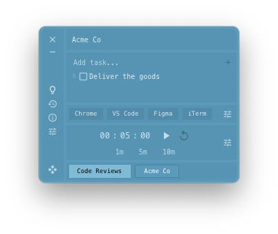

# Context ~~Switcher~~ Maintainer

[Download for macOS (Apple Silicon)](https://github.com/TravisBumgarner/context-maintainer/releases/latest/download/Context.Maintainer_aarch64.dmg)

**For the person with 5 desktops and no idea what's on any of them.**


Each macOS desktop gets its own todo list, timer, and theme. Switch desktops and your context switches with you.



## Features

- **Todos** — Per-desktop tasks that follow you as you switch
- **Timers** — A countdown tied to each desktop
- **Desktop switcher** — See all your spaces, jump between them instantly
- **Common apps** — One-click access to the apps you use everywhere
- **Themes** — 14 palettes that style the entire app
- **Multi-monitor** — One window per display, settings sync everywhere
- **Auto-hide** — Shows on switch, disappears when you're focused
- **Session management** — Save your context, restore it later

---

## Common Apps - Custom Commands

Not all apps support opening a new instance with `open -n`. You can set a custom command per app in the Common Apps settings. Below are known working commands:

| App | Custom Command | Notes |
| --- | --- | --- |
| Figma | — | Not supported |
| Firefox | — | Default behavior works |
| Google Chrome | `osascript -e 'tell application "Google Chrome" to make new window'` | |
| iTerm2 | — | Default behavior works |
| Linear | — | Default behavior works |
| Microsoft Edge | — | Default behavior works |
| Notion | — | Not supported |
| Obsidian | — | Not supported |
| Postico | — | Default behavior works |
| Postman | — | Not supported |
| Safari | — | Default behavior works |
| Slack | — | Not supported |
| VS Code | `code --new-window` | Requires CLI tool installed |
| WhatsApp | — | Not supported |

If you discover a working command for another app, feel free to open a PR to add it here.

---

## Tech

Built with [Tauri 2](https://tauri.app/), React, and Rust. Uses macOS CoreGraphics APIs for reliable virtual desktop detection without polling AppleScript.

## Logs

Production logs are written by `tauri-plugin-log` to:

```
~/Library/Logs/com.travisbumgarner.context-switching/
```

```bash
tail -f ~/Library/Logs/com.travisbumgarner.context-switching/*.log
```

## Releasing

See [`.github/workflows/README.md`](.github/workflows/README.md) for secrets setup and certificate generation.

1. Bump the version: `npm run version-bump -- --patch` (or `--minor` / `--major`)
2. Update `CHANGELOG.md` with the new version's changes
3. Open a PR, get it reviewed and merged
4. Go to Actions > "Build and Release (macOS)" > Run workflow
5. Review the draft release, then publish it

Once published, running copies of the app will detect the update on next launch.

## License

MIT
